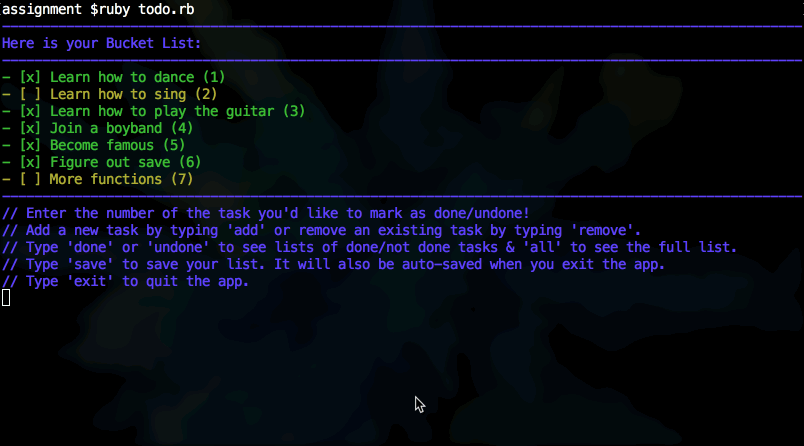

# Ruby Todo App

This is a todo app that can be used for creating and updating a bucket list.

## Functions

- [x] Can display your bucket list of tasks
- [x] Can mark items as done / not done
- [x] Can display lists of tasks that have been completed / not completed
- [x] Can add new tasks to your bucket list
- [x] Can remove existing tasks from your bucket list
- [x] Can save the task list